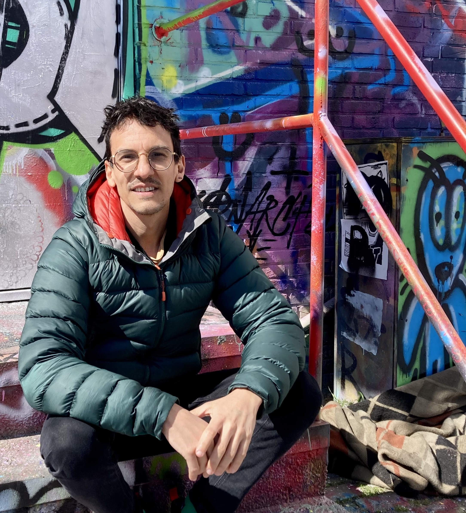

I am an Assistant Professor in the <a href="https://sps.unimi.it/it/dipartimento">Department of Social and Political Sciences</a> at the University of Milan and a research associate at the <a href="https://www.universiteitleiden.nl/en/social-behavioural-sciences/political-science">Institute of Political Science</a> at Leiden University. In Milan, I co-convene the Milan Conflict Research Seminar (MiCoRes) and the UNIMI–Bocconi Political Science Seminar. I am also a member of the <a href="https://www.acrn.nl/">Amsterdam Conflict Research Network (ACRN)</a> and serve on the Editorial Board of the <em>International Studies Review</em>.

My research integrates different methods and forms of evidence, often incorporating extensive fieldwork, to study political and criminal violence. I am particularly interested in the decision-making processes of individuals and communities living in violent settings, and in how their experiences with violence shape political preferences, including attitudes toward different policy responses to violence and crime, as well as support for democratic institutions and norms. I have examined these questions in countries affected by civil war and organized crime, including Colombia, Mexico, Brazil, Ecuador, and Italy.

I am an active member of APSA’s Qualitative and Multi-Method Research Section and previously served as co-editor of its biannual publication, <em><a href="https://www.qmmrpublication.com/">Qualitative &amp; Multi-Method Research (QMMR)</a></em>. I also teach methods and research design in several doctoral programs and summer schools, including the Essex Summer School and the ECPR Summer School.

Before joining the University of Milan, I was a tenured Assistant Professor at Leiden University and previously a Lecturer in the Department of Politics and International Relations (DPIR) and an Associate Member of Nuffield College at the University of Oxford. I was also a Postdoctoral Fellow at the Bremen International Graduate School of Social Science (BIGSSS) and a Research Fellow at the Program on Order, Conflict and Violence (OCV) at Yale University.

I received my Ph.D. from the European University Institute in 2017.

For my full CV, click <a href="files/cv.pdf">here</a>.

You can reach me at <a href="mailto:juan.masullo@unimi.it">juan.masullo@unimi.it</a>.

