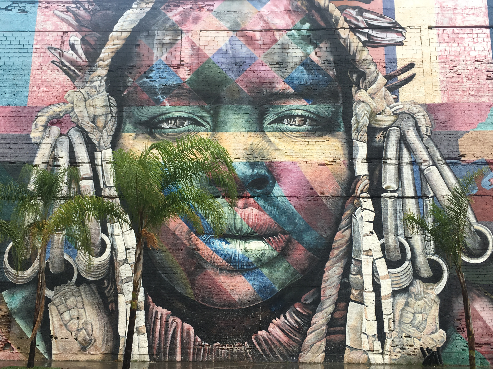

{.hero-banner}

# Juan Masullo J. (and passionate rock climber)

[**University of Milan**](https://www.unimi.it/en/ugov/ou-structure/department-social-and-political-sciences)

I am an Assistant Professor of Political Science at the University of Milan and a research affiliate at Leiden University. My research focuses on political and criminal violence, with a particular focus on Latin America.

Using a range of methods, I study how individuals and communities respond to violence, the legacies these responses leave and how exposure to violence shapes political attitudes and behavior.

<a href="mailto:juan.masullo@unimi.it" title="Email">
<i class="bi bi-envelope"></i>
</a>

<a href="https://scholar.google.com/citations?user=YOURID" target="_blank" title="Google Scholar">
<i class="ai ai-google-scholar"></i>
</a>

<a href="https://orcid.org/0000-0002-8537-2991" target="_blank" title="ORCID">
<i class="ai ai-orcid"></i>
</a>

[About](about.qmd) | [Publications](publications.qmd) | [CV](cv.qmd)
